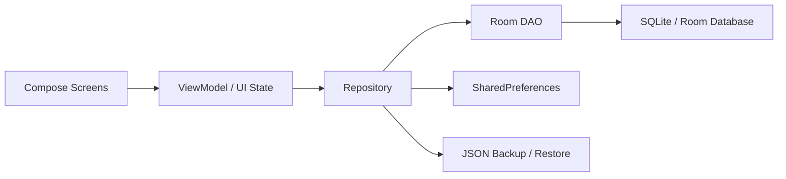

# SportLife

SportLife（运动生活记录）是一款离线优先的 Android 运动记录应用，面向日常跑步、力量训练和训练计划管理场景。项目使用 Kotlin、Jetpack Compose、MVVM 和 Room 构建，重点展示移动端本地数据建模、Compose 复杂界面、训练记录闭环和数据迁移能力。

体验 APK 可在 [GitHub Releases](https://github.com/XuYui/SportLife/releases/tag/v2.6) 下载；源码仓库仅保留可复现的工程代码，不提交 APK、AAB、签名文件和本地 SDK 配置。

## 项目亮点

- 跑步与力量训练双场景打卡：支持公里数、配速、日期、备注、训练部位和训练动作记录。
- 训练计划管理：支持三分化、四分化和自定义训练结构，可编辑训练日、小板块、动作、组数、重量和次数。
- 历史记录与统计：按日期查看、编辑、删除记录，并用 Compose Canvas 绘制里程、配速和训练频率图表。
- 本地优先数据架构：Room 数据库、DAO、Repository 分层，保留 schema 文件并提供显式迁移。
- 数据备份与恢复：支持将打卡记录、动作库、训练计划、计划自动快照和用户偏好导出为 JSON，再从备份恢复。
- 简洁的 Compose 架构：Navigation Compose 管理页面流转，ViewModel 暴露 UI state，界面层保持声明式。

## 工程实现

- 使用单 Activity + Navigation Compose 组织页面流转，ViewModel 负责状态聚合和用户操作分发。
- 通过 Repository 隔离 UI 与 Room 数据源，结合 Coroutines 与 StateFlow 管理异步查询和界面刷新。
- 为 Room 开启 schema 导出并维护显式 migration，便于追踪本地数据库结构演进。
- 设计 JSON 备份与恢复流程，按外键关系控制清理、导入和默认数据回填顺序。
- 使用 Compose Canvas 自绘折线图、柱状图和雷达图，避免为轻量统计场景引入额外图表库。

## 技术栈

- 语言与构建：Kotlin、Gradle Kotlin DSL、Java 17
- UI：Jetpack Compose、Material 3、Navigation Compose
- 架构：MVVM、Repository、单 Activity 架构
- 数据：Room、SQLite、SharedPreferences、JSON 备份
- 异步：Kotlin Coroutines、StateFlow
- 图表：Compose Canvas 自绘折线图、柱状图和雷达图

## 功能模块

- 首页：展示今日训练状态、最近记录、快捷入口和可编辑激励语。
- 跑步打卡：记录距离、配速、日期与备注，并自动生成训练摘要。
- 健身打卡：按训练分化选择部位，记录力量训练完成情况。
- 训练计划：管理训练分化、训练日、小板块和动作配置。
- 历史记录：按日期筛选记录，支持编辑与删除。
- 统计分析：汇总跑步里程、配速趋势和不同部位训练频率。
- 数据迁移：导出完整 JSON 备份，也可从备份文本恢复本地数据。

## 架构概览



## 项目结构

```text
app/src/main/java/com/sportlife/records
├── data
│   ├── backup          # JSON 导出与导入
│   ├── local           # Room 数据库、DAO、Entity、Migration
│   └── repository      # 业务数据仓库
├── domain              # 领域模型与工具
└── ui
    ├── component       # 通用 Compose 组件
    ├── navigation      # 页面路由与 ViewModelFactory
    ├── screen          # 首页、打卡、计划、历史、统计、备份页面
    └── theme           # Material 主题与颜色
```

## 数据模型与迁移

SportLife 使用一张通用打卡表 `WorkoutCheckInEntity` 作为历史记录入口，再通过跑步详情、力量训练详情和训练计划相关表扩展不同运动场景。Room schema 位于 `app/schemas`，当前数据库版本为 2，迁移逻辑在 `DatabaseMigrations.kt` 中维护。

## 本地运行

环境要求：

- Android Studio
- JDK 17+
- Android SDK，项目 `compileSdk = 36`

常用命令：

```powershell
.\gradlew.bat tasks --no-daemon
.\gradlew.bat compileDebugSources --no-daemon
```

也可以用 Android Studio 打开项目根目录，等待 Gradle 同步后运行 `app` 模块。
